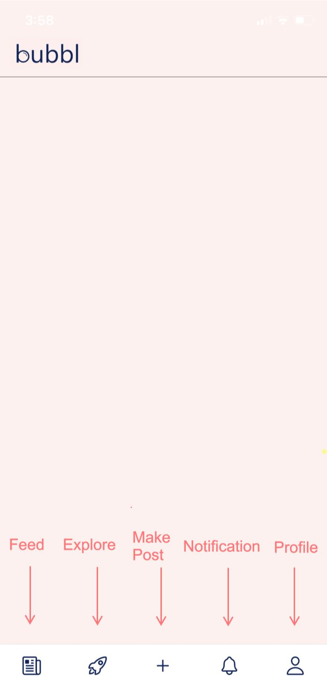
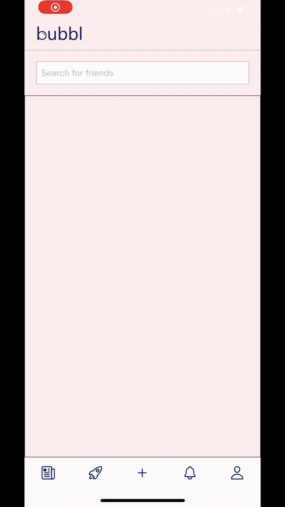
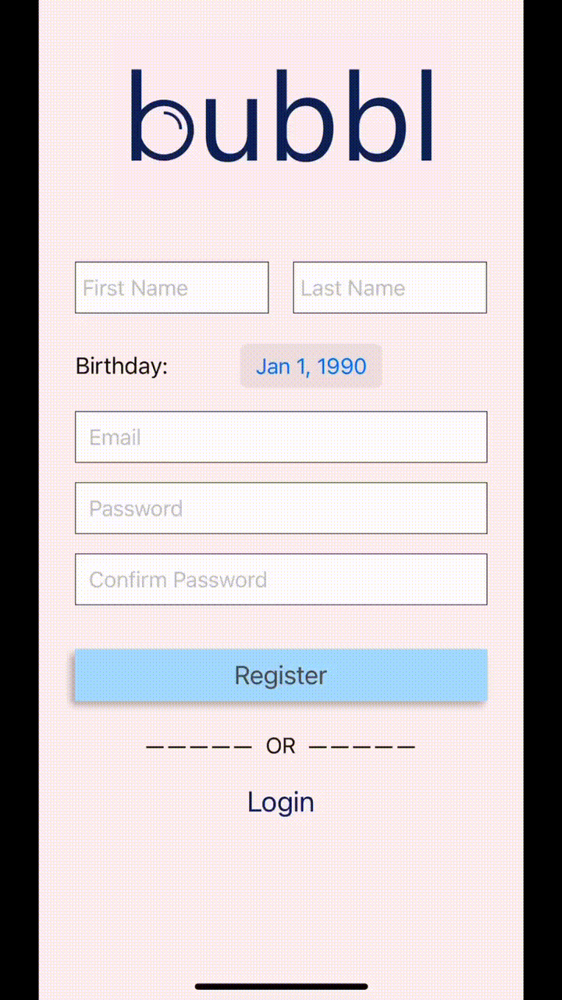
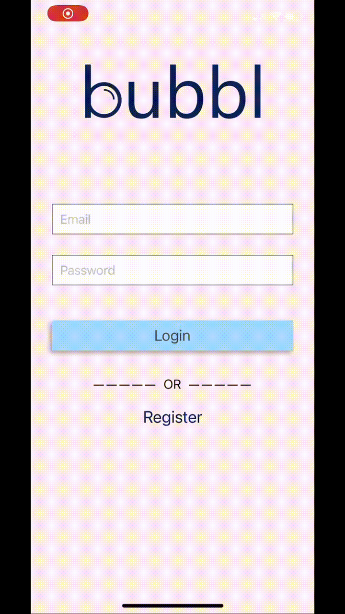

# bubbl - Social Media App
- JavaScript, React Native, Redux and Firebase

bubbl is a social media app that allows a user to share and view posts with people in their "bubbl". The frontend is developed using React Native with Redux and the backend and database logic is developed with Firebase. 

The main features of bubbl:
  1. User registration and authentication
  2. Tab menu in footer for easy navigation between pages
  3. Search bar to find friends
  4. Share a textual post with a title
  5. Share an image with a caption
  6. View posts from people in your bubbl
  7. Header with logo

The main pages of bubbl:
  1. Profile
  2. Create Post
  3. Explore
  4. Feed
  5. User Registration
  6. User Login

### 0. Header and Footer

### 1. Profile Page

### 2. Create Post Pages
##### 2.1 Create Textual Post

##### 2.2 Create Image Post

### 3. Explore

### 4. Feed

### 5. User Registration

### 6. User Login

